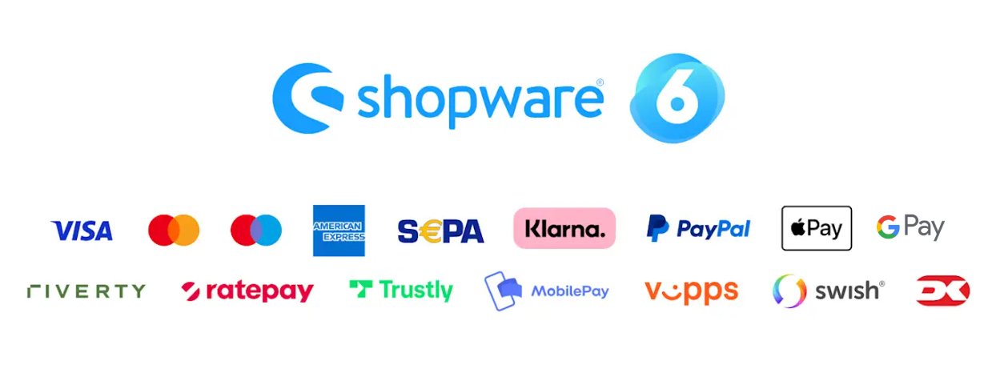

# Checkout for Shopware

This guide describes how to install, configure, and use the Nexi Checkout webshop module for Shopware 6.6.

## Before you start

> Before you start, you need a Checkout Portal account. See the guide [Create account](https://developer.nexigroup.com/nexi-checkout/en-EU/docs/create-a-checkout-portal-account/) for more information about creating a free test account.

## Overview

Our Shopware plugin is the perfect extension to enable the Nexi Checkout to its full potential for your Shopware store. Checkout supports most popular payment methods.

You may see below all the payment methods offered by Checkout. This list refers to all markets.

Depending on your country or region, the list may vary. If you are uncertain about a specific payment method and whether it is available in your country or region, please [contact Support](https://developer.nexigroup.com/nexi-checkout/en-EU/support/) for more information.

## Shop features

- A smart mix of payment methods to suit all preferences.
- Multiple checkout languages and currencies for selling in your domestic market and abroad.

## Administration features

- Quick setup and flexible configuration.
- Intuitive order management with synchronized payments status via webhooks.
- Refund and capture available with new items list feature.
- Compatibility with discounts, tax (VAT), and shipping options.
- Compatible with multi-shop setups.
- Automate various processes with the flow builder functionality.

## Installation

How to install the Checkout module for Shopware 6:

1. Connect with an SSH client and navigate to the root directory of your Shopware 6 installation.
2. Install the plugin by running the command: `bin/console plugin:install NetsCheckout`
3. Activate the plugin by running the command: `bin/console plugin:activate NetsCheckout`
4. Clear the cache by running the command: `bin/console cache:clear`

The module is now installed and ready to be configured for your Checkout account.

## Configuration

After installing the module, you need to do some basic configuration of the module in Shopware Admin:

1. Navigate to `Extensions > My extensions > Nexi Payment Plugin`
2. Locate the Nexi Group payment plugin and press the button with three dots (...) to access the configuration.
3. Fill out the required fields, such as merchant ID and integration keys (secret keys and checkout keys).
4. (Optional) Customize the module according to your needs using the additional settings on the configuration page.

Both the merchant ID and the integration keys can be found in Checkout Portal. See the following pages for more help:

- [Where can I find my merchant number (merchant ID)?](#)
- [Access your integration keys](#)

## Order management

It's possible to manage orders directly in the Shopware administration:

1. Navigate to `Admin > Orders > Overview`.
2. Press on an order line to access order details.
3. Choose your desired action: cancel, capture, or refund. The Checkout plugin will synchronize automatically. The payment status will also be updated in Checkout portal.

All transactions performed by Nexi Group are accessible in Checkout Portal.

## Klarna

The payment method Klarna requires a phone number to function properly. To ensure that Klarna will appear as a payment option in the Nexi Group payment window, it is essential to configure the phone number field correctly. For more information, please refer to the Klarna guide.

To add the phone number field in Shopware 6, follow these steps:

1. Navigate to `Settings > Shop > Log-in & Sign-up`.
2. Check the box for `Show phone number`.
3. Check the box for `Phone number field required`.

To learn more, visit Shopware 6's documentation.

## Important Note

> We do not support third-party plugins that provide phone number functionality, and we cannot guarantee that their solution will be compatible with the Klarna payment method.

## Troubleshooting

Below are some of the most common configuration errors, their cause, and steps that you can follow to solve them.

### Nexi Group payment plugin is not visible as a payment method

- Ensure the Nexi Group module is available in the right Sales Channel in the plugin configuration.
- Under the Sales Channel section, select your Shop Name under General settings. Add plugin in Payment methods.
- Temporarily switch to the Shopware 6 standard template. Custom templates might need additional changes to ensure correct display. Consult with your web designer or developer.

### Nexi Group payment window is blank

- Ensure your integration keys in the Nexi Group plugin settings are correct and do not contain additional blank spaces.
- Temporarily deactivate third-party plugins that might affect the functionality of the plugin.
- Check if there are any temporary technical inconsistencies: [Operational Status](https://nets.eu/Pages/operational-status.aspx)

### Payments in live mode don't work

- Ensure you have an approved Live Checkout account for production.
- Ensure your Live Checkout account is approved for payments with the selected currency.
- Ensure payment method data is correct and supported by your Checkout agreement.

## Go live checklist

For more information, refer to the section [Go-live checklist](#).

## See also

- [Create account](#)
- [Test environment](#)
- [Test card processing](#)
- [Test invoice & installment processing](#)
- [Support](#)

Was this helpful?