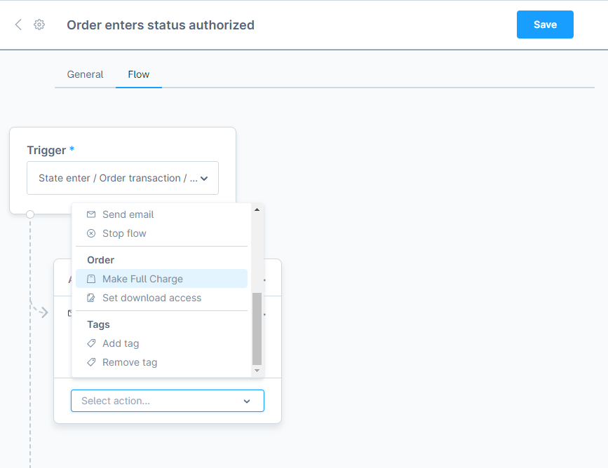
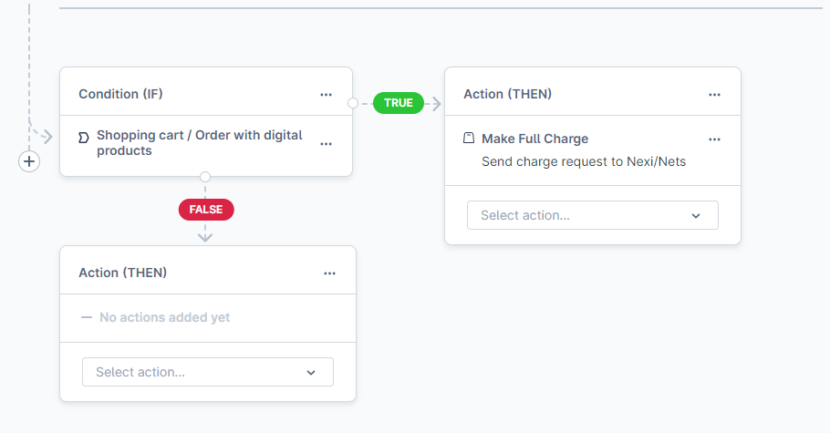

# Create custom flow with Nexi Nets actions and flow builder

## Overview

Nexi Nets Payment Plugin allows administrators to automate various processes within the payment system with help of flow builder. 

[Read more about Flow builder.](https://developer.shopware.com/docs/guides/plugins/plugins/framework/flow/add-flow-builder-action.html)

## Key Features

- **Visual Interface**: Drag-and-drop interface to create workflows.
- **Triggers**: Define events that start the workflow (e.g., payment status changes).
- **Actions**: Specify actions to be taken when a trigger occurs (e.g., make a full charge, send a notification).
- **Conditions**: Add conditions to control the flow of actions based on specific criteria.

## Accessing Flow Builder

1. Log in to the admin panel.
2. Navigate to `Settings` > `Shop` > `Flow Builder`.

## Add Nexi Nets action into flow

You have two ways to create or modify a flow:

- Create a new flow by clicking the "Add Flow" button.
- Edit an existing flow by selecting an event from the "My Flows" tab.

In both cases, you'll be taken to the event settings page to configure your flow.

1. Navigate to `Flow` tab inside event settings.
2. Add `Action (THEN)` or click on `Select action` dropdown.
3. Navigate to `Order` section.
4. Choose Nexi Nets action that you want to add into flow.
5. Save the flow.

## List of Nexi Nets actions

### Make Full Charge

- Send charge request to Nexi/Nets API.

## Managing Flows

### Auto capture for digital goods

- Create a new flow or edit an existing one.
- Add a condition: `Click on Condition (IF)`.
- Select `Shopping cart / Order with digital products`.
- In true `Action(THEN)` select `Make Full Charge` action.
- In false `Action(THEN)` choose another flow or action.

## Troubleshooting